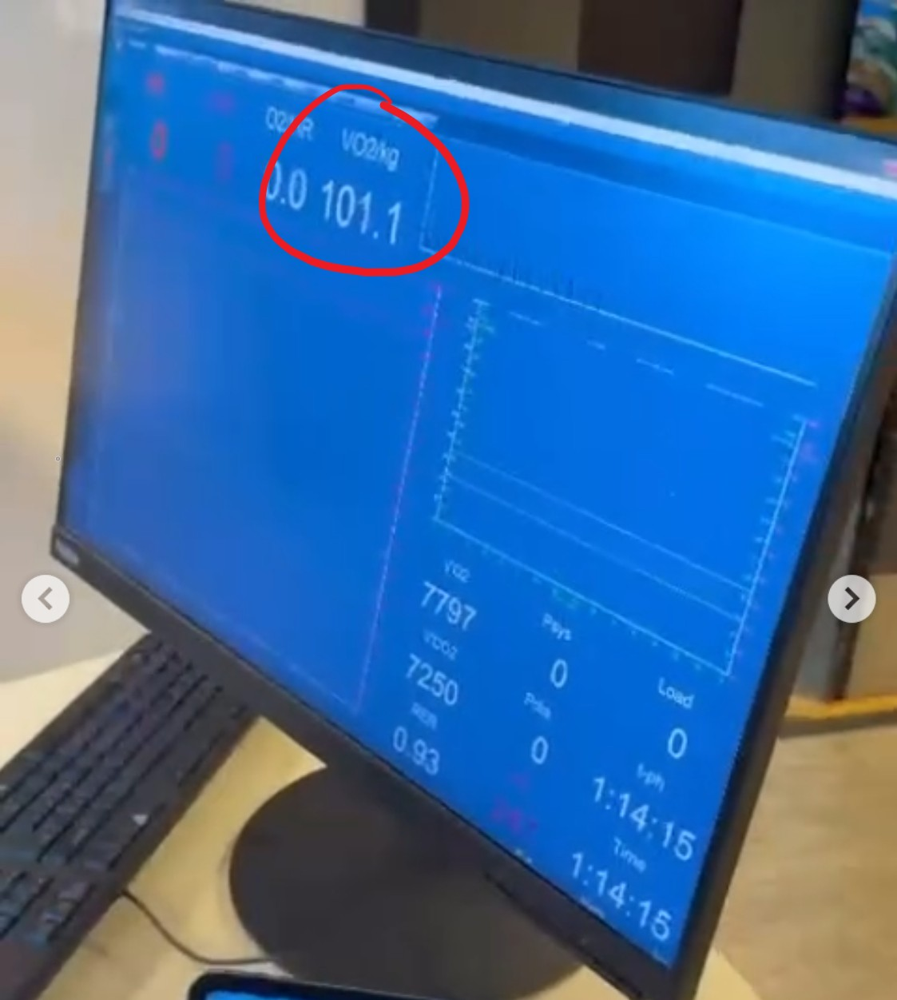
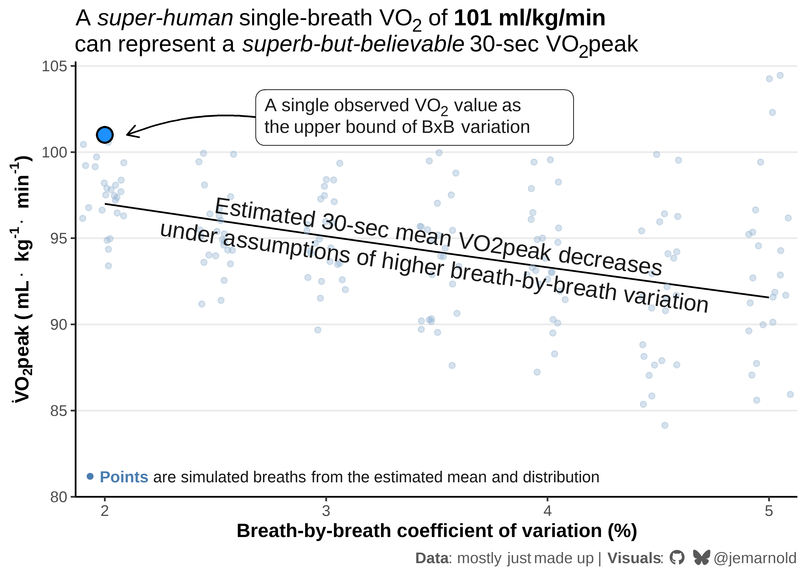
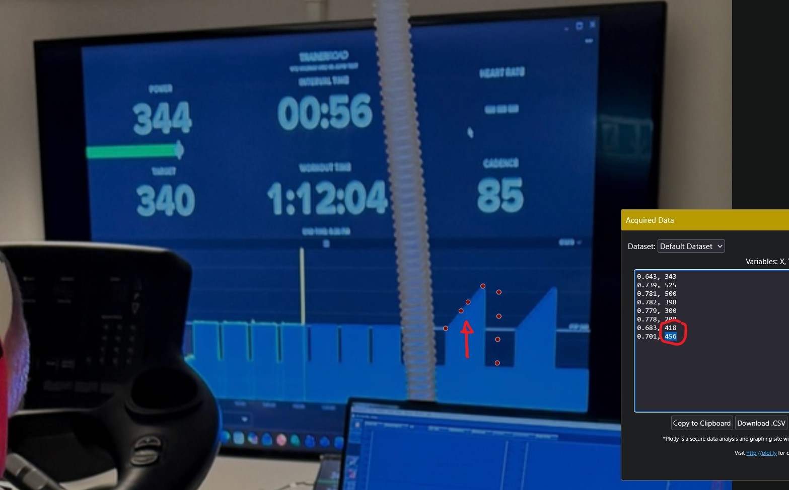
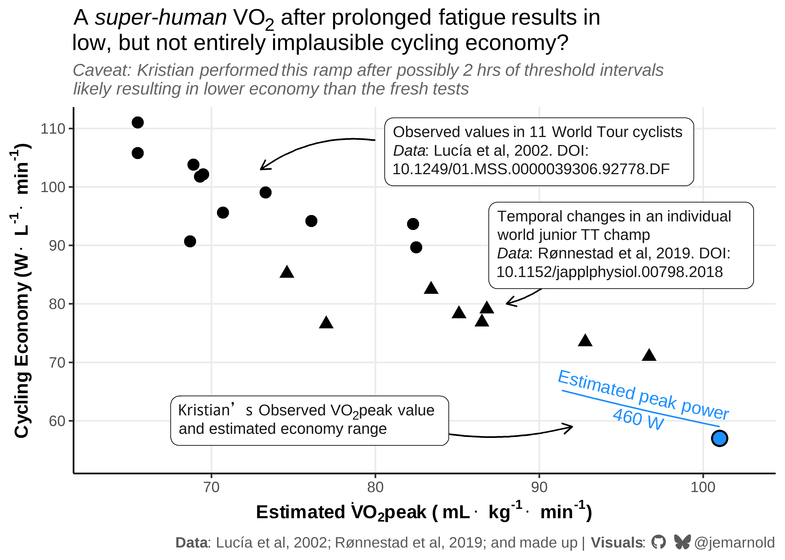

# Superhuman VO2peak Estimate
Jem Arnold [](https://github.com/jemarnold)
[](https://bsky.app/profile/jemarnold.bsky.social)
[](https://researchgate.net/profile/Jem-Arnold)
[](https://orcid.org/0000-0003-3908-9447)
2026-01-31

In a recent instagram post, `@kristianblu` showed a screenshot with a
VO<sub>2</sub> reading of **101 ml/kg/min**. If this were to be
validated, it would be - to my knowledge - the highest recorded
VO<sub>2</sub>peak, and the first human to record over 100 ml/kg/min.



<details>

<summary>

Figure description (click to expand)
</summary>

Metabolic cart data displayed briefly at the end of Kristian’s test
protocol, showing a VO2 value of 101.1 ml/kg/min (circled), and 7797
ml/min. VCO2 reads 7250 ml/min and RER is 0.93. Test time appears to be
1:14:15. No other data is legible on screen.

</details>

Big if true.

Big ‘if’.

## What is the breath-by-breath variance in VO<sub>2</sub> around VO<sub>2</sub>peak?

VO<sub>2</sub>peak is typically defined as the peak average oxygen
uptake recorded over 30-seconds. More likely, I suspect, the 101 value
represents something more like the highest *single breath* recorded
during the trial, not a formal 30-sec VO<sub>2</sub>peak.

> [!NOTE]
>
> I’ve been informed it was a mixing chamber system, not
> breath-by-breath, which effectively samples an exponentially weighted
> moving average of breaths. It might still be possible to show the
> highest single sample, but the variance would be in a much tigher
> range. I’ve updated the numbers below to account for this

I don’t know if any of this is true or valid or even interesting, but I
thought it might be interesting to do some metabolic maths on the
numbers we have, to put Kristian’s potential values here in perspective.

First, I wanted to estimate what Kristian’s mean 30-sec VO<sub>2</sub>
value might be to see a single value of 101, given known variance of
typical breath-by-breath measurements.

Let’s assume 101 represents the upper 95% prediction bound of the
VO<sub>2</sub> data sampled within the 30-sec BxB data. i.e. this value
is around +2 SD from the local mean VO<sub>2</sub> values sampled around
his VO<sub>2</sub>peak.

To estimate the mean 30-sec VO<sub>2</sub> value from that upper bound,
we need to estimate:

1.  the number of samples, i.e. the number of breaths, and;
2.  the expected coefficient of variation (CV) for BxB VO<sub>2</sub>
    data.

It turns out the number of breaths doesn’t meaningfully impact the
results per se. Only if it influences the variance of the measurements,
which I don’t know if/how it does. So we can stick with a reasonable
static value of 50 breaths per minute.

CV is tougher to estimate, and depends very much on the athlete and the
metabolic system. But from looking at some recent data collected in our
lab with Parvo TrueOne 2400 (which is also a mixing chamber system with
pseudo-breath-by-breath sampling), I’d estimate a potentially wide range
of ~~5-10%~~ 2-5%. This represents the variability between ~~breaths~~
samples during a 30-sec period around VO<sub>2</sub>peak.

<details class="code-fold">
<summary>Show setup code</summary>

``` r
library(tidyverse)
library(geomtextpath)
library(ggtext)
library(sysfonts)
library(showtext)

sysfonts::font_add(
    family = "fa-brands",
    regular = r"(C:\Users\Jem\AppData\Local\Microsoft\Windows\Fonts\Font Awesome 7 Brands-Regular-400.otf)"
)
showtext::showtext_opts(dpi = 600)
showtext::showtext_auto()

## custom theme
theme_set(
    theme_bw(base_size = 12) +
        theme(
            plot.title = ggtext::element_textbox_simple(
                size = rel(1.2),
                lineheight = 1.1
            ),
            plot.subtitle = ggtext::element_textbox(
                colour = "grey40",
                size = 11,
                face = "italic",
                hjust = 0,
                lineheight = 1.1,
                margin = margin(t = 6, b = 6)
            ),
            plot.caption = ggtext::element_textbox(
                colour = "grey35",
                halign = 1
            ),
            panel.border = element_blank(),
            axis.line = element_line(),
            axis.title = element_text(face = "bold"),
            panel.grid.major = element_blank(),
            panel.grid.minor = element_blank(),
            legend.position = "none"
        )
)

social_caption <- "<span style='font-family:fa-brands'>&#xf09b; &#xe671;</span> @jemarnold"
```

</details>

<details class="code-fold">
<summary>Show figure 1 code</summary>

``` r
df <- expand_grid(
    cv = seq(0.02, 0.05, 0.005),
    # RR = seq(40, 70, 5), ## negligible influence on results
    RR = 70 ## reasonable estimate for peak RR
) |>
    mutate(
        samples = (RR / 60) * 30,  ## number of breaths within 30-sec
        t_crit = qt(0.975, samples - 1), ## t-distribution ~ 2 SD
        vo2peak = 101 / (1 + t_crit * cv * sqrt(1 + 1 / samples))
    )

## generate simulated breath-by-breath data along prediction curve
set.seed(13)
simulated_breaths <- map_df(unique(df$cv), \(.cv) {
    mean_vo2 <- df[df$cv == .cv, ]$vo2peak

    ## number of breaths within 30-sec
    n_breaths <- 25

    ## predict normally distributed VO2 values around mean, according to cv
    tibble(
        cv = .cv,
        breath = seq_len(n_breaths),
        vo2 = rnorm(n_breaths, mean = mean_vo2, sd = mean_vo2 * .cv),
    )
})

# fmt: skip
ggplot(df, aes(x = cv, y = vo2peak)) +
    labs(
        title = str_glue(
            "A *super-human* single-breath VO<sub>2</sub> of ",
            "**101 ml/kg/min**<br>can represent a *superb-but-believable* ",
            "30-sec VO<sub>2</sub>peak"
        ),
        caption = str_glue(
            "**Data**: mostly just made up  |  **Visuals**: {social_caption}"
        )
    ) +
    theme(panel.grid.major.y = element_line()) +
    coord_cartesian(ylim = c(80, 105)) +
    scale_x_continuous(
        name = "Breath-by-breath coefficient of variation (%)",
        labels = scales::percent_format(suffix = ""),
        expand = expansion(0.01)
    ) +
    scale_y_continuous(
        name = expression(bold(
            dot('V')*O['2']*peak~'('~mL%.%kg^'-1'%.%min^'-1'*')'
        )),
        n.breaks = 6,
        expand = expansion(c(0, 0.01))
    ) +
    geom_line() +
    # Add simulated breath-by-breath points
    geom_point(
        data = simulated_breaths,
        aes(x = cv, y = vo2),
        alpha = 0.4, size = 1.5, colour = "#98b6d3",
        position = position_jitter(width = 0.001, height = 0, seed = 234)
    ) +
    annotate(
        "point", x = 0.02, y = 101, size = 4, shape = 21, stroke = 1,
        fill = "dodgerblue"
    ) +
    annotate(
        "curve", x = 0.03, xend = 0.021, y = 101, yend = 101,
        arrow = arrow(length = unit(0.03, "npc")),
        curvature = 0.2
    ) +
    ggtext::geom_textbox(
        data = data.frame(),
        aes(
            x = 0.034, y = 102, 
            label = paste(
                "A single observed VO<sub>2</sub> value as",
                "the upper bound of BxB variation",
                sep = "<br>"
            )
        ),
        colour = "grey10", size = 4, width = unit(70, "mm"),
    ) +
    geomtextpath::geom_textline(
        aes(
            label = paste(
                "Estimated 30-sec mean VO2peak decreases",
                "under assumptions of higher breath-by-breath variation",
                sep = "\n"
            )
        ),
        colour = "grey10", linewidth = 0, 
        size = 5, hjust = 0.5, halign = "center", vjust = 0.55
    ) + 
    ggtext::geom_richtext(
        data = data.frame(),
        aes(
            x = -Inf, y = -Inf, 
            label = str_glue(
                "<span style = 'color:#4a7db0'>",
                "**● Points**</span> ",
                "are simulated breaths from the estimated mean and distribution"
            )
        ),
        label.size = NA,
        colour = "grey10", size = 3.5, vjust = -0.2, hjust = -0.01
    )
```

</details>



<details>

<summary>

Figure description (click to expand)
</summary>

A line graph showing the relationship between breath-by-breath
coefficient of variation (x-axis, range = 2-5%) and estimated 30-second
mean VO₂peak (y-axis, 80-105 ml·kg⁻¹·min⁻¹). A blue dot at 101
ml·kg⁻¹·min⁻¹ represents a single observed VO₂ value as the possible
upper bound of breath-by-breath variation. A downward-sloping black line
shows that as CV (breath-by-breath variation) increases from 2% to 5%,
the estimated 30-sec mean VO₂peak decreases from approximately 97 to 92
ml·kg⁻¹·min⁻¹. Additional points representing simulated breaths start
tightly grouped around the mean where CV = 2%, and become more scattered
at the higher CV values, according to the estimated distribution of VO2
breath measurements. Figure title: “A super-human single-breath VO₂ of
101 ml·kg⁻¹·min⁻¹ can represent a superb-but-believable 30-sec VO₂peak”.
The line is labelled “Estimated 30 sec mean VO2peak decreases under
assumptions of higher breath by breath variation”. “Visuals:
@jemarnold”.

</details>

Across this range of ~~5-10%~~ 2-5% variation, the 30-sec mean
VO<sub>2</sub>peak value might be anywhere from ~97 ml/kg/min to 92
ml/kg/min. The higher estimate is still basically world-record setting,
whereas the lower estimate ~~would be only “superb” but very reasonable
for a world-class endurance athlete.~~ is still pretty rediculously
high.

## What was his peak power and cycling economy (W/L/min) at peak?

The next obvious interest is what workload was Kristian able to reach
which elicited 101 ml/kg/min?

The first image in the post shows his protocol. He appears to be around
half way through a series of threshold intervals at **340 W**. Kristian
is using the TrainerRoad platform. The white horizontal line is where
his functional threshold power (FTP) is set for this session. That
doesn’t necessarily mean 340 W is his actual threshold, but it’s where
it’s set for this workout.

In a study published in 2024 on Kristian, his reported cycling at
lactate threshold 2 was **373 W**. So 340 W is at least in a similar
neighbourhood, considering we don’t know the time of year or training
phases where these values were recorded.

With some plot-digitiser sleuthing, we can estimate Kristian’s peak
power during the ramp, after his threshold workout.


<details>

<summary>

Figure description (click to expand)
</summary>

A video frame capture at low resolution showing the TrainerRoad
interface running the test protocol. Discernable is 7 intervals at what
appears to be set as Kristian’s threshold in the interface, which from
another image we know is 340 W. A white vertical line demarcs the
current workload around half way through the ramp. This video appears to
be taken immediately after Kristian has reached maximal task tolerance
during the session, so this seems reasonable to estimate as his peak
power.

</details>

We briefly see the TrainerRoad interface in the video. We can just about
see the vertical white line representing current power is around
half-way through the first ramp.

From a more clear picture, we can see the faint horizontal margin lines
in the TrainerRoad interface. These represent 100 W bounds. Knowing
this, using [WebPlotDigitizer](https://automeris.io/WebPlotDigitizer/),
we can pull a range of power values around the centre of the ramp.



<details>

<summary>

Figure description (click to expand)
</summary>

A video frame capture showing the TrainerRoad interface running the test
protocol. Kristian is half way through seven intervals at what is set as
his threshold power in the interface, at 340 W. Faint horizontal lines
demarcating 100 W bands are visible on the interface. Using
WebPlotDigitizer, we can estimate what Kristian’s peak power might have
been mid-way through the ramp protocol, based on the previous image. A
red arrow points to the estimated range of possible peak power values,
from 420-460 W.

</details>

This suggests his peak power was somewhere between 420-460 W. Let’s call
it **460 W**.

From this, we can estimate a range for cycling economy from ~57 to 62
W/L/min. This range is far below previous data observed in professional
cyclists, at around 90-100+ W/L/min at lower VO<sub>2</sub>peak values.

But interestingly, when we look at another Norweigen athlete with - dare
I say, more believable - published VO<sub>2</sub>peak values of 90+
ml/kg/min, his cycling economy appears to fill the gap between the
professional cyclists and Kristian.

A caveat is that these previous protocols were performed with the
athletes fresh, whereas Kristian performed his after what might have
been as much as two hours of prior threshold work. This will tend to
result in higher power for the same VO<sub>2</sub> in fresh tests. So
it’s not a perfect comparison here.

Another interesting observation to point out; cycling economy appears to
be inversely-related to VO<sub>2</sub>peak in these data sets. However,
there have been many statistical and methodological discussions for why
this observation [might be
spurious](https://pubmed.ncbi.nlm.nih.gov/12840650/).

<details class="code-fold">
<summary>Show figure 2 code</summary>

``` r
RER <- 0.93 ## observed RER
# O2kJ <- 4.83535 * RER + 16.88348 ## kJ/L derived from Péronnet & Massicotte, 1991
weight <- 7797 / 101 ## observed 101 ml/min/kg = 7797 ml/min; 77.2 kg

df <- expand_grid(
    cv = seq(0, 0.05, 0.005),
    RR = 50 ## reasonable estimate for peak RR
) |>
    mutate(
        samples = (RR / 60) * 30, ## number of breaths within 30-sec
        t_crit = qt(0.975, samples - 1), ## t-distribution ~ 2 SD
        vo2peak = 101 / (1 + t_crit * cv * sqrt(1 + 1 / samples))
    )

economy_df <- expand_grid(
    vo2peak = df$vo2peak, ## crudely estimated from expected BxB variance
    power = 460, ## estimated from video
) |>
    mutate(
        economy = power / (vo2peak * weight / 1000) ## W/L/min
    )

lucia_df <- tribble(
    ~power , ~vo2 , ~vo2peak ,
       515 , 5744 , 82.5     ,
       585 , 5531 , 65.5     ,
       505 , 5099 , 73.3     ,
       500 , 5339 , 82.3     ,
       465 , 5128 , 68.7     ,
       515 , 4962 , 68.9     ,
       550 , 5841 , 76.1     ,
       535 , 5257 , 69.3     ,
       490 , 4798 , 69.5     ,
       580 , 5224 , 65.5     ,
       500 , 5230 , 70.7
) |>
    mutate(
        economy = power / vo2 * 1000
    )

ronnestad_df <- tribble(
    ~vo2 , ~vo2peak , ~power ,
    5575 , 74.6     ,    475 ,
    6064 , 83.4     ,    500 ,
    6472 , 86.8     ,    512 ,
    6389 , 85.1     ,    500 ,
    7397 , 96.7     ,    525 ,
    7307 , 92.8     ,    537 ,
    6831 , 86.5     ,    525 ,
    6205 , 77.0     ,    475
) |>
    mutate(
        economy = power / vo2 * 1000
    )

# fmt: skip
ggplot(economy_df) +
    aes(vo2peak, economy) +
    labs(
        title = str_glue(
            "A *super-human* VO<sub>2</sub> after prolonged fatigue results in",
            "<br>low, but not entirely implausible cycling economy?",
        ),
        subtitle = str_glue(
            "Caveat: Kristian performed this ramp after possibly 2 hrs of threshold intervals",
            "<br>likely resulting in lower economy than the fresh tests"
        ),
        caption = str_glue(
            "**Data**: Lucía et al, 2002; Rønnestad et al, 2019; and made up  |  ",
            "**Visuals**: {social_caption}",
        )
    ) +
    theme(panel.grid.major = element_line()) +
    coord_cartesian(
        xlim = c(62, 104),
        ylim = c(51, 113)
    ) +
    scale_x_continuous(
        name = expression(bold(
            Estimated~dot('V')*O['2']*peak~'('~mL%.%kg^'-1'%.%min^'-1'*')'
        )),
        n.breaks = 6,
        expand = expansion(0.01)
    ) +
    scale_y_continuous(
        name = expression(bold(Cycling~Economy~'('*W%.%L^'-1'%.%min^'-1'*')')),
        expand = expansion(c(0, 0.01))
    ) +
    annotate(
        "point", x = 101, y = 57, size = 4, shape = 21, stroke = 1,
        fill = "dodgerblue"
    ) +
    annotate(
        "curve", x = 81, xend = 92, y = 60, yend = 59,
        arrow = arrow(length = unit(0.03, "npc")),
        curvature = 0.15
    ) +
    ggtext::geom_textbox(
        data = data.frame(),
        aes(
            x = 76, y = 60, 
            label = paste(
                "Kristian's Observed VO<sub>2</sub>peak value",
                "and estimated economy range",
                sep = "<br>"
            )
        ),
        colour = "grey10", size = 3.5, width = unit(63, "mm"),
    ) +
    geom_line(colour = "dodgerblue") +
    geomtextpath::geom_textline(
        aes(label = str_glue("Estimated peak power\n{power} W")),
        colour = "dodgerblue",
        linewidth = 0, size = 4, hjust = 0.5, halign = "center"
    ) +
    geom_point(data = lucia_df, size = 3, shape = 19, colour = "black") +
    annotate(
        "curve", x = 80, xend = 73, y = 108, yend = 103,
        arrow = arrow(length = unit(0.03, "npc")),
        curvature = 0.2
    ) +
    ggtext::geom_textbox(
        data = data.frame(),
        aes(
            x = 90, y = 106, 
            label = paste(
                "Observed values in 11 World Tour cyclists",
                "*Data*: Lucía et al, 2002. DOI:",
                "10.1249/01.MSS.0000039306.92778.DF",
                sep = "<br>"
            )
        ),
        colour = "grey10", size = 3.5, width = unit(70, "mm"),
    ) +

    geom_point(data = ronnestad_df, size = 3, shape = 17, colour = "black") +
    annotate(
        "curve", x = 92, xend = 88, y = 88, yend = 80,
        arrow = arrow(length = unit(0.03, "npc")),
        curvature = -0.2
    ) +
    ggtext::geom_textbox(
        data = data.frame(),
        aes(
            x = 95, y = 90,
            label = paste(
                "Temporal changes in an individual world junior TT champ",
                "*Data*: Rønnestad et al, 2019. DOI:",
                "10.1152/japplphysiol.00798.2018",
                sep = "<br>"
            )
        ),
        colour = "grey10", size = 3.5, width = unit(60, "mm"),
    )
```

</details>



<details>

<summary>

Figure description (click to expand)
</summary>

Scatterplot showing relationship between estimated VO₂peak (x-axis,
60-110 ml/kg/min) and cycling economy (y-axis, 60-110 W/L/min). Black
dots represent observed values in 11 World Tour cyclists from Lucía et
al. 2002 (DOI: 10.1249/01.MSS.0000039306.92778.DF), clustered between
90-105 ml/kg/min and 90-110 W/L/min. Black triangles represent observed
values in a single World Junior TT champ from Rønnestad et al, 2019
(DOI: 10.1152/japplphysiol.00798.2018) clustered from 70-85 W/L/min. A
blue diagonal line shows estimated cycling economy for Kristian at
estimated peak power of 440 W. A blue dot at approximately 101 ml/kg/min
and 57 W/L/min represents the observed value in the video. Title: “A
super-human VO₂ after prolonged fatigue results in very poor cycling
economy compared to fresh World Tour Pros”. Subtitle: “A big caveat: the
Lucía, 2002 ramp was much shorter and so peak powers and economy will
tend to be higher”. Caption: “Data: Lucia et al, 2002; Ronnestad et al,
2019; and made up. Visuals: @jemarnold”.

</details>

## Conclusion: masterful trolling

In conclusion, Kristian’s social media team really knows how to troll us
by teasing at these values. Naive media companies post headlines of his
“world record VO2max” without any critical attention to the
methodological details. His competitors get spooked by his superhuman
numbers. And all of us sport scientists on social media get into a tizzy
about how the numbers are impossible and they should really calibrate
their equipment better.

To me, the number is “real”, as in, it is a number on the screen. The
question is what that number represents and how they attained it. I
think it’s possible from these estimations that it could possibly be
their highest sampled VO<sub>2</sub>peak value, along with the other
interventions hinted at: prolonged threshold work prior to the ramp,
possibly dietary manipulation or other conditions which would tend to
increase aerobic capacity at the trade off of mechanical efficiency and
work economy.

In the end, implausible results like this can lead us to asking more
interesting questions!
