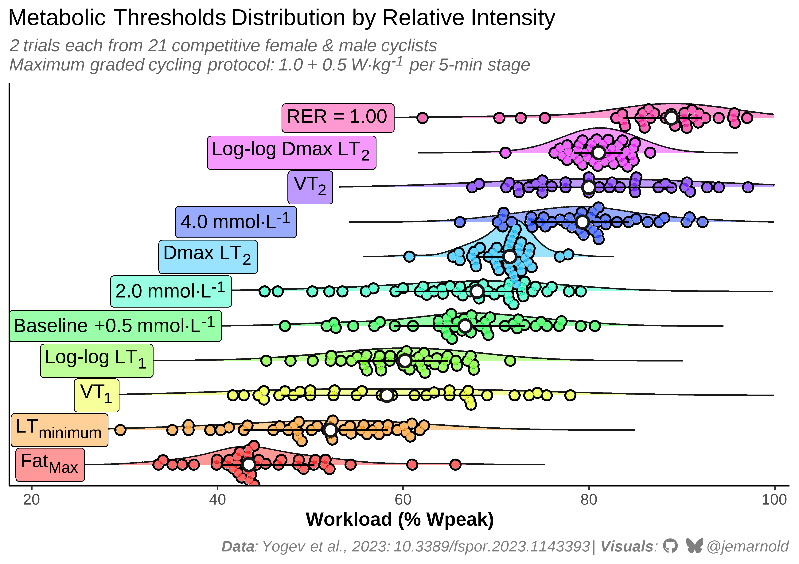
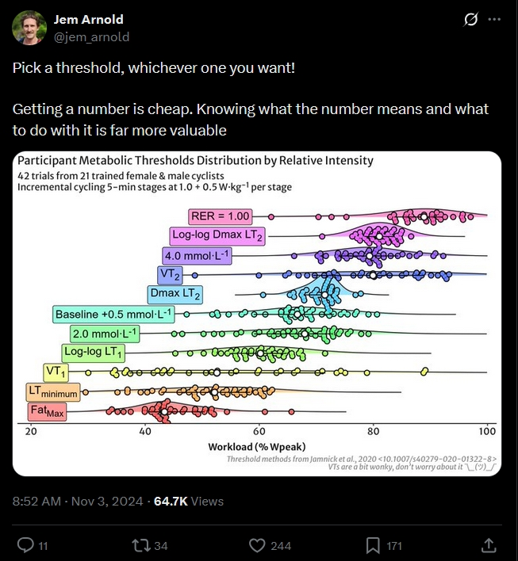

# Thresholds Distribution
Jem Arnold [](https://github.com/jemarnold)
[](https://bsky.app/profile/jemarnold.bsky.social)
[](https://researchgate.net/profile/Jem-Arnold)
[](https://orcid.org/0000-0003-3908-9447)
2026-03-20

<details class="code-fold">
<summary>Show setup code</summary>

``` r
library(tidyverse)
library(ggdist)
library(ggtext)
library(ggbeeswarm)
library(sysfonts)
library(showtext)

sysfonts::font_add(
    family = "fa-brands",
    regular = r"(C:\Users\Jem\AppData\Local\Microsoft\Windows\Fonts\Font Awesome 7 Brands-Regular-400.otf)"
)
showtext::showtext_opts(dpi = 600)
showtext::showtext_auto()

## custom theme
theme_set(
    theme_bw(base_size = 12) +
        theme(
            plot.title = ggtext::element_textbox_simple(
                size = rel(1.2),
                lineheight = 1.1
            ),
            plot.subtitle = ggtext::element_textbox(
                colour = "grey40",
                size = 11,
                face = "italic",
                hjust = 0,
                lineheight = 1.1,
                margin = margin(t = 6, b = 6)
            ),
            plot.caption = ggtext::element_textbox(
                colour = "grey35",
                halign = 1,
                lineheight = 1.1
            ),
            panel.border = element_blank(),
            axis.line = element_line(),
            axis.title = element_text(face = "bold"),
            panel.grid.major = element_blank(),
            panel.grid.minor = element_blank(),
            legend.position = "none"
        )
)

social_caption <- "<span style='font-family:fa-brands'>&#xf09b; &#xe671;</span> @jemarnold"
```

</details>

### Pick a threshold, whichever one you want!

### Getting a number is cheap. Knowing what the number means and what to do with it is far more valuable

<details class="code-fold">
<summary>Show figure 1 code</summary>

``` r
## I haven't updated the style of the plot
## it's a mess, but it gets the job done

y_vals <- c(0.22, 0.23, 0.27, 0.27, 0.29, 0.35, 0.39, 0.42, 0.5, 0.48, 0.53)

ggplot(df, aes(x = threshold, y = power)) +
    labs(
        title = "Metabolic Thresholds Distribution by Relative Intensity",
        subtitle = str_glue(
            "2 trials each from 21 competitive female & male cyclists",
            "<br>",
            "Maximum graded cycling protocol: 1.0 + 0.5 W·kg<sup>-1</sup> per 5-min stage"
        ),
        caption = str_glue(
            "**Data**: Yogev et al., 2023: 10.3389/fspor.2023.1143393  |  **Visuals**: {social_caption}",
            # "**Data**: Yogev et al., 2023: 10.3389/fspor.2023.1143393  |  **Visuals**: Jem Arnold",
            # "Threshold methods from Jamnick et al., 2020: <10.1007/s40279-020-01322-8>",
            # "<br>",
            # "VT1 is a bit wonky, dont worry about it ¯\\\\_(ツ)\\_/¯"
        )
    ) +
    coord_flip(
        xlim = c(NA, NA),
        ylim = c(0.20, 1.00),
    ) +
    theme(
        plot.caption = ggtext::element_textbox(
            colour = "grey50",
            size = rel(0.8),
            hjust = 1,
            halign = 1,
            face = "italic",
            margin = margin(t = 6)
        ),
    ) +
    scale_x_discrete(
        name = NULL,
        breaks = NULL,
    ) +
    scale_y_continuous(
        name = "Workload (% Wpeak)",
        labels = seq(20, 100, 20),
        limits = c(0.2, 1),
        expand = expansion(mult = c(0.03, 0.02))
    ) +
    scale_colour_manual(
        name = NULL,
        aesthetics = c("colour", "fill"),
        values = rainbow(length(unique(df$threshold))),
        limits = force
    ) +
    ggdist::stat_slab(
        aes(fill = threshold),
        scale = 1.1,
        slab_alpha = 0.4,
        adjust = 2,
        expand = FALSE,
        trim = FALSE,
        density = "unbounded",
        slab_colour = "grey10",
        slab_linewidth = 0.5
    ) +
    ggdist::stat_slab(
        fill = NA,
        scale = 1.1,
        slab_alpha = 1,
        adjust = 2,
        expand = FALSE,
        trim = FALSE,
        density = "unbounded",
        slab_colour = "grey10",
        slab_linewidth = 0.5,
        point_size = 2
    ) +
    ggbeeswarm::geom_beeswarm(
        fill = "white",
        shape = 21,
        stroke = 1,
        size = 2.4,
        cex = 1.3
    ) +
    ggbeeswarm::geom_beeswarm(colour = "white", size = 1.9, cex = 1.3) +
    ggbeeswarm::geom_beeswarm(
        aes(fill = threshold),
        shape = 21,
        stroke = 0,
        size = 2.5,
        alpha = 0.6,
        cex = 1.3
    ) +
    ggdist::stat_pointinterval(
        point_fill = "white",
        point_colour = "grey10",
        point_size = 3,
        shape = 21,
        stroke = 1.2,
        linewidth = 0.5,
        .width = 0.66,
        expand = FALSE,
        trim = FALSE,
        density = "unbounded"
    ) +

    geom_rect(
        data = tibble(),
        inherit.aes = FALSE,
        aes(
            xmin = c(3, 6, 9, 11) - 0.2,
            xmax = c(3, 6, 9, 11) + 0.2,
            ymin = c(0.2),
            ymax = c(0.27, 0.35, 0.53, 0.48)
        ),
        fill = "white",
        colour = "white"
    ) +
    ggtext::geom_richtext(
        data = ~ slice(.x, .by = threshold, 1),
        aes(y = y_vals, label = threshold),
        fill = "white",
        size = 4.3,
        alpha = 1
    ) +
    ggtext::geom_richtext(
        data = ~ slice(.x, .by = threshold, 1),
        aes(y = y_vals, fill = threshold, label = threshold),
        size = 4.3,
        alpha = 0.4
    ) +
    ggtext::geom_richtext(
        data = ~ slice(.x, .by = threshold, 1),
        aes(y = y_vals, label = threshold),
        fill = "transparent",
        size = 4.3
    )
```

</details>



<details>

<summary>

Show figure description
</summary>

A raincloud plot showing the distribution of 11 metabolic threshold
estimation methods (lactate and ventilatory thresholds) across relative
workload (% Wpeak) from two trials each in 21 female and male
competitive cyclists. Thresholds are stacked vertically, colour-coded
from red (FatMax; occuring at the lowest intensity) to pink (RER = 1.00,
at the highest intensity), each displaying a kernel density curve,
individual data points (n ≈ 42), and a white median marker. The intent
is to visualise how various threshold estimates return values all along
the range of relative intensity, thus suggesting that there is no single
true intensity breakpoint, but rather that different methods find
threshold-like behaviours at different intensities, depending on which
metabolic variable and analyses methods are used.

</details>

Data from Yogev et al., 2023:
https://doi.org/10.3389/fspor.2023.1143393.

Methods from: Jamnick et al., 2020:
https://dx.doi.org/10.1007/s40279-020-01322-8

An old figure, originally posted to twitter. Reproduced and updated on
request.

[](https://x.com/jem_arnold/status/1853118123966419360)

<details>

<summary>

Show figure description
</summary>

Original twitter thread of the above figure, posted by Jem Arnolf
(@jem_arnold) 2024-11-03.

</details>
