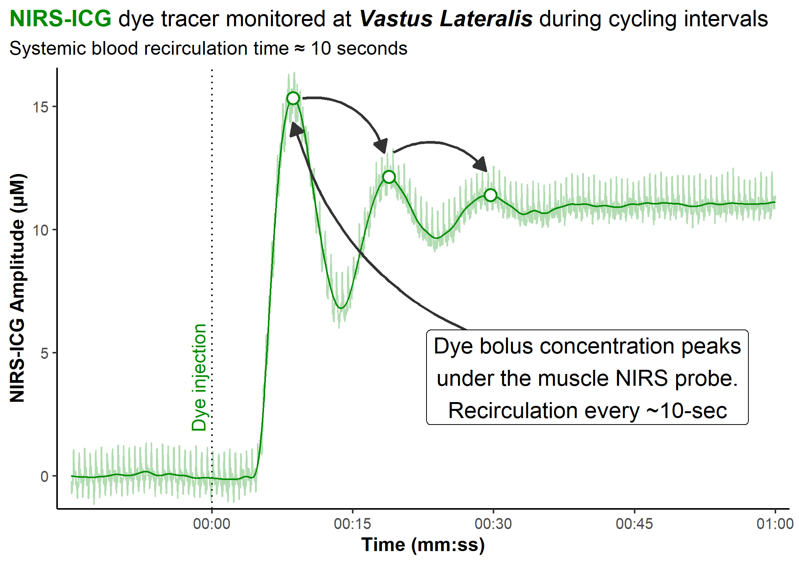

# Recirculation Speed
Jem Arnold
2026-06-25

<details class="code-fold">
<summary>Show setup code</summary>

``` r
library(tidyverse)
#> Warning: package 'tidyverse' was built under R version 4.5.3
#> Warning: package 'ggplot2' was built under R version 4.5.3
#> Warning: package 'tibble' was built under R version 4.5.3
#> Warning: package 'tidyr' was built under R version 4.5.3
#> Warning: package 'readr' was built under R version 4.5.3
#> Warning: package 'purrr' was built under R version 4.5.3
#> Warning: package 'dplyr' was built under R version 4.5.3
#> Warning: package 'stringr' was built under R version 4.5.3
#> Warning: package 'forcats' was built under R version 4.5.3
#> Warning: package 'lubridate' was built under R version 4.5.3
#> ── Attaching core tidyverse packages ──────────────────────── tidyverse 2.0.0 ──
#> ✔ dplyr     1.2.1     ✔ readr     2.2.0
#> ✔ forcats   1.0.1     ✔ stringr   1.6.0
#> ✔ ggplot2   4.0.2     ✔ tibble    3.3.1
#> ✔ lubridate 1.9.5     ✔ tidyr     1.3.2
#> ✔ purrr     1.2.2     
#> ── Conflicts ────────────────────────────────────────── tidyverse_conflicts() ──
#> ✖ dplyr::filter() masks stats::filter()
#> ✖ dplyr::lag()    masks stats::lag()
#> ℹ Use the conflicted package (<http://conflicted.r-lib.org/>) to force all conflicts to become errors
library(JAPackage)

df <- readRDS(file = r"(C:\R-Projects\data-vis-threads\2026-06-25\recirculation-df)")

points_df <- tibble::tribble(
    ~time , ~VL_ICG_filt ,
     8.62 , 15.34        ,
    18.82 , 12.14        ,
    29.66 , 11.4         ,
)

theme_set(theme_JA(plot.title.position = "plot"))
```

</details>

How long does it take for blood to make a full round-trip throughout the
entire body during exercise?

Around 10-sec!

That’s way faster than I intuitively would have expected!

But we’re only reproducing what’s been known since at least the 1950s 👇

``` r

ggplot(df, aes(x = time)) +
        labs(
            title = str_glue(
                "<span style = 'color:green4'>**NIRS-ICG**</span>",
                " dye tracer monitored at ",
                "***Vastus Lateralis*** ",
                "during cycling intervals"
            ),
            subtitle = "Systemic blood recirculation time ≈ 10 seconds"
        ) +
        scale_x_continuous(
            name = "Time (mm:ss)",
            breaks = seq(0, 60, 15),
            labels = mnirs::format_hmmss,
            expand = expansion(0.02)
        ) +
        scale_y_continuous(
            name = "NIRS-ICG Amplitude (μM)",
            expand = expansion(0.01)
        ) +
        scale_colour_manual(
            aesthetics = c("colour", "fill"),
            values = c(VL = "green4"),
        ) +
        geom_vline(xintercept = 0, linetype = "dotted") +
        geom_line(aes(y = VL_ICG, colour = "VL"), alpha = 0.3) +
        geom_line(aes(y = VL_ICG_filt, colour = "VL")) +
        geom_point(
            data = points_df,
            aes(x = time, y = VL_ICG_filt, colour = "VL"),
            size = 3, shape = 21, stroke = 1, fill = "white"
        ) + 
        annotate(
            "text", x = 0, y = 4, label = "Dye injection",
            angle = 90, vjust = -0.5, hjust = 0.5, colour = "green4"
        ) +
        # one arrow from text label to first peak, then bouncing peak-to-peak
        annotate(
            "curve",
            x = c(45, head(points_df$time, -1) + c(1, 0.5)),
            y = c(5, head(points_df$VL_ICG_filt, -1) + c(0, 1)),
            xend = points_df$time + c(0, -0.5, -0.5),
            yend = points_df$VL_ICG_filt + c(-1, 1, 1),
            arrow = arrow(length = unit(3, "mm"), type = "closed"),
            linewidth = 0.8, colour = "grey20", curvature = -0.4,
        ) +
        annotate(
            "label", x = 40, y = 4,
            label = "Dye bolus concentration peaks\nunder the muscle NIRS probe.\nRecirculation every ~10-sec", fill = "white", size = 5, hjust = 0.5, vjust = 0.5
        )
#> Warning in grid.Call(C_stringMetric, as.graphicsAnnot(x$label)): font family
#> not found in Windows font database
#> Warning in grid.Call(C_stringMetric, as.graphicsAnnot(x$label)): font family
#> not found in Windows font database
#> Warning in grid.Call(C_stringMetric, as.graphicsAnnot(x$label)): font family
#> not found in Windows font database
#> Warning in grid.Call(C_textBounds, as.graphicsAnnot(x$label), x$x, x$y, : font
#> family not found in Windows font database
#> Warning in grid.Call(C_textBounds, as.graphicsAnnot(x$label), x$x, x$y, : font
#> family not found in Windows font database
#> Warning in grid.Call(C_textBounds, as.graphicsAnnot(x$label), x$x, x$y, : font
#> family not found in Windows font database
#> Warning in grid.Call(C_textBounds, as.graphicsAnnot(x$label), x$x, x$y, : font
#> family not found in Windows font database
#> Warning in grid.Call(C_textBounds, as.graphicsAnnot(x$label), x$x, x$y, : font
#> family not found in Windows font database
#> Warning in grid.Call(C_textBounds, as.graphicsAnnot(x$label), x$x, x$y, : font
#> family not found in Windows font database
#> Warning in grid.Call(C_textBounds, as.graphicsAnnot(x$label), x$x, x$y, : font
#> family not found in Windows font database
#> Warning in grid.Call(C_textBounds, as.graphicsAnnot(x$label), x$x, x$y, : font
#> family not found in Windows font database
#> Warning in grid.Call(C_textBounds, as.graphicsAnnot(x$label), x$x, x$y, : font
#> family not found in Windows font database
#> Warning in grid.Call(C_textBounds, as.graphicsAnnot(x$label), x$x, x$y, : font
#> family not found in Windows font database
#> Warning in grid.Call(C_textBounds, as.graphicsAnnot(x$label), x$x, x$y, : font
#> family not found in Windows font database
#> Warning in grid.Call.graphics(C_text, as.graphicsAnnot(x$label), x$x, x$y, :
#> font family not found in Windows font database
#> Warning in grid.Call.graphics(C_text, as.graphicsAnnot(x$label), x$x, x$y, :
#> font family not found in Windows font database
#> Warning in grid.Call(C_textBounds, as.graphicsAnnot(x$label), x$x, x$y, : font
#> family not found in Windows font database
#> Warning in grid.Call.graphics(C_text, as.graphicsAnnot(x$label), x$x, x$y, :
#> font family not found in Windows font database
#> Warning in grid.Call.graphics(C_text, as.graphicsAnnot(x$label), x$x, x$y, :
#> font family not found in Windows font database
#> Warning in grid.Call.graphics(C_text, as.graphicsAnnot(x$label), x$x, x$y, :
#> font family not found in Windows font database
#> Warning in grid.Call.graphics(C_text, as.graphicsAnnot(x$label), x$x, x$y, :
#> font family not found in Windows font database
#> Warning in grid.Call.graphics(C_text, as.graphicsAnnot(x$label), x$x, x$y, :
#> font family not found in Windows font database
#> Warning in grid.Call.graphics(C_text, as.graphicsAnnot(x$label), x$x, x$y, :
#> font family not found in Windows font database
#> Warning in grid.Call.graphics(C_text, as.graphicsAnnot(x$label), x$x, x$y, :
#> font family not found in Windows font database
#> Warning in grid.Call.graphics(C_text, as.graphicsAnnot(x$label), x$x, x$y, :
#> font family not found in Windows font database
```



A figure showing near-infrared spectroscopy (NIRS) tracing over the
vastus lateralis quadricep muscle during a cycling VO2max interval, with
indocyanine green (ICG) dye tracer injected at time 0:00; as the dye
appears with blood flow under the probe, the optical signal rapidly
reaches a peak at ~10-seconds after first injection. The concentration
decays briefly, then rises to a second and third peak at ~10-sec
increments, showing transit time around the entire systemic circulation
(from quadriceps, via venous blood back through lungs to heart, and out
again in arterial circulation to the quadriceps). Figure title:
“NIRS-ICG dye tracer monitored at vastus lateralis during cycling
intervals. Systemic blood recirculation time ≈ 10 seconds”. Text label:
“Dye bolus concentration peaks under the NIRS probe. Recirculation every
~10-sec”.
