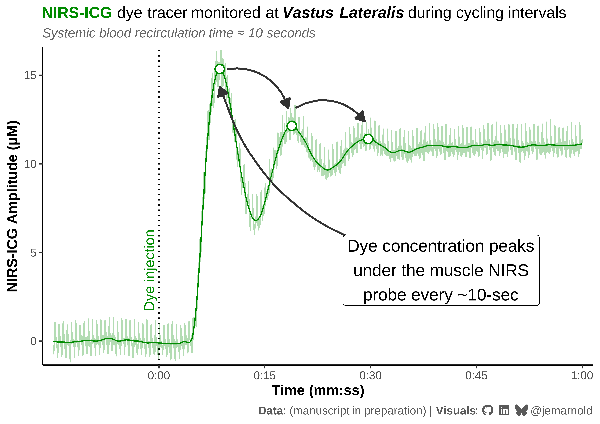
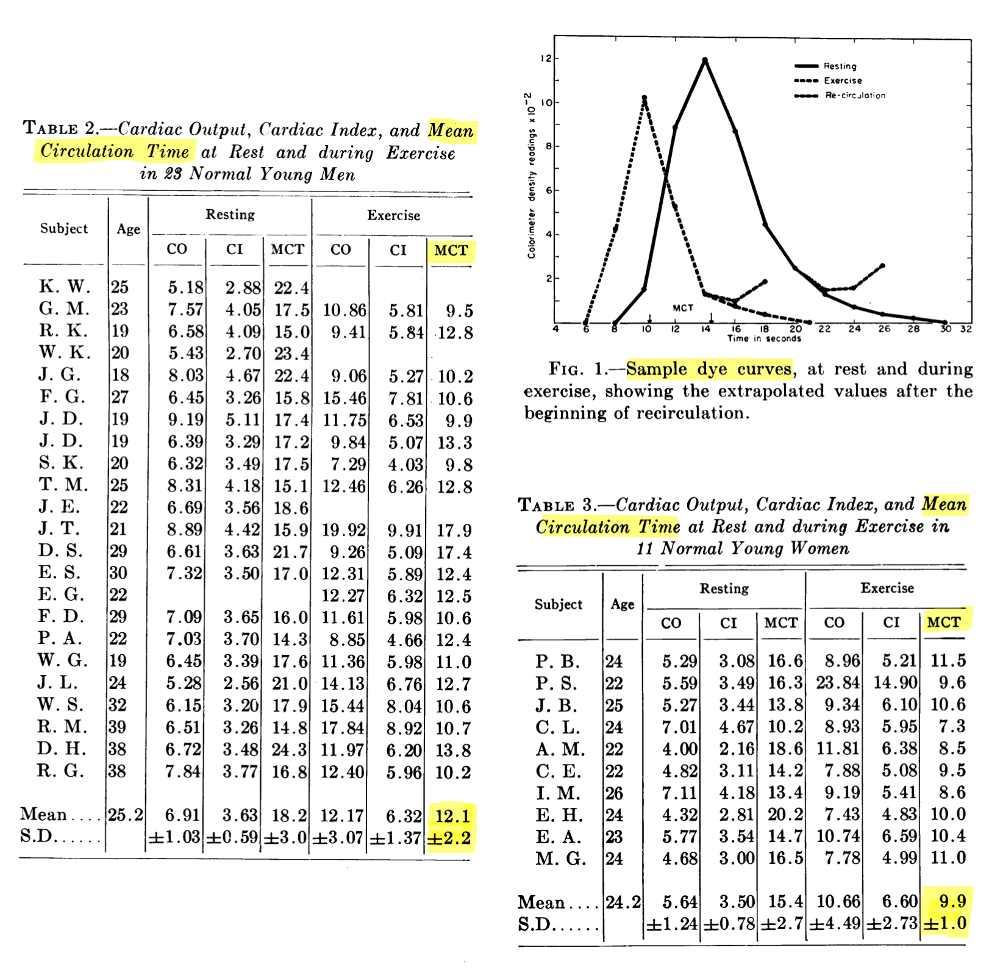

```{r}
#| label: setup
#| eval: !expr knitr::is_html_output()
#| warning: false
#| code-fold: true
#| code-summary: "Show setup code"

library(ggplot2)
library(tibble)
library(ggtext)
library(sysfonts)
library(showtext)

sysfonts::font_add(
    family = "fa-brands",
    regular = r"(C:\Users\Jem\AppData\Local\Microsoft\Windows\Fonts\Font Awesome 7 Brands-Regular-400.otf)"
)
showtext::showtext_opts(dpi = 600)
showtext::showtext_auto()

## custom theme
theme_set(
    theme_bw(base_size = 12) +
        theme(
            plot.title = ggtext::element_textbox_simple(
                size = rel(1.1),
                lineheight = 1.1
            ),
            plot.subtitle = ggtext::element_textbox(
                colour = "grey40",
                size = 11,
                face = "italic",
                hjust = 0,
                lineheight = 1.1,
                margin = margin(t = 6, b = 6)
            ),
            plot.caption = ggtext::element_textbox(
                colour = "grey35",
                halign = 1,
                lineheight = 1.1
            ),
            panel.border = element_blank(),
            axis.line = element_line(),
            axis.title = element_text(face = "bold"),
            panel.grid.major = element_blank(),
            panel.grid.minor = element_blank(),
            legend.position = "none"
        )
)

social_caption <- "<span style='font-family:fa-brands'>&#xf09b; &#xf08c; &#xe671;</span> @jemarnold"
```


How long does it take for blood to make a full round-trip around the entire body during exercise? 🫁🫀🔁🦵

Only 10-sec!
That’s way faster than I intuitively would have expected

But we’re just reproducing what’s been known for the last century👇 #science #medicine #rstats #datavis

```{r}
#| label: load data
#| code-fold: true
#| code-summary: "Show loading data code"
#| cache: true

df <- readRDS("recirculation-df")

points_df <- tibble::tribble(
    ~time , ~VL_ICG_filt ,
     8.62 , 15.34        ,
    18.82 , 12.14        ,
    29.66 , 11.4         ,
)
```

```{r}
#| label: figure-1
#| eval: !expr knitr::is_html_output()
#| code-fold: true
#| code-summary: "Show figure 1 code"
#| cache: true

ggplot(df, aes(x = time)) +
    labs(
        title = paste(
            "<span style = 'color:green4'>**NIRS-ICG**</span> ",
            "dye tracer monitored at ***Vastus Lateralis*** ",
            "during cycling intervals"
        ),
        subtitle = "Systemic blood recirculation time ≈ 10 seconds",
        caption = paste(
            "**Data**: (manuscript in preparation)  |  **Visuals**: ",
            social_caption
        ),
    ) +
    scale_x_continuous(
        name = "Time (mm:ss)",
        breaks = seq(0, 60, 15),
        labels = \(x) sprintf("%d:%02d", x %/% 60, x %% 60),
        expand = expansion(0.02)
    ) +
    scale_y_continuous(
        name = "NIRS-ICG Amplitude (μM)",
        expand = expansion(0.01)
    ) +
    scale_colour_manual(
        aesthetics = c("colour", "fill"),
        values = c(VL = "green4"),
    ) +
    geom_vline(xintercept = 0, linetype = "dotted") +
    geom_line(aes(y = VL_ICG, colour = "VL"), alpha = 0.3) +
    geom_line(aes(y = VL_ICG_filt, colour = "VL")) +
    geom_point(
        data = points_df,
        aes(x = time, y = VL_ICG_filt, colour = "VL"),
        size = 3,
        shape = 21,
        stroke = 1,
        fill = "white"
    ) +
    annotate(
        "text",
        x = 0,
        y = 4,
        label = "Dye injection",
        angle = 90,
        vjust = -0.5,
        hjust = 0.5,
        colour = "green4"
    ) +
    # one arrow from text to first peak, then bouncing peak-to-peak
    annotate(
        "curve",
        x = c(45, head(points_df$time, -1) + c(1, 0.5)),
        y = c(5, head(points_df$VL_ICG_filt, -1) + c(0, 1)),
        xend = points_df$time + c(0, -0.5, -0.5),
        yend = points_df$VL_ICG_filt + c(-1, 1, 1),
        arrow = arrow(length = unit(3, "mm"), type = "closed"),
        linewidth = 0.8,
        colour = "grey20",
        curvature = -0.4,
    ) +
    annotate(
        "label",
        x = 40,
        y = 4,
        label = paste(
            "Dye concentration peaks",
            "under the muscle NIRS",
            "probe every ~10-sec",
            sep = "\n"
        ),
        fill = "white",
        size = 5,
        hjust = 0.5,
        vjust = 0.5
    )
```


```{r}
#| label: figure-1-include
#| eval: !expr isFALSE(knitr::is_html_output())
#| echo: false

## avoid re-rendering the figure in README.MD at the wrong scale

```

<details>
<summary>Show figure description</summary>

A figure showing near-infrared spectroscopy (NIRS) tracing over the vastus lateralis quadriceps muscle during a cycling VO2max interval, with indocyanine green (ICG) dye tracer injected into the median cubital vein at time 0:00. As the dye appears with blood flow in the VL under the probe, the optical signal rapidly reaches a peak at ~10-seconds after injection. The concentration briefly decays as the dye tracer flows out of the insonation site, then rises to a second and third peak at ~10-sec intervals, showing net transit time around the entire systemic circulation (from quadriceps, via venous blood back through lungs to heart, and out again via arterial circulation to the quadriceps). Figure title: "NIRS-ICG dye tracer monitored at vastus lateralis during cycling intervals. Systemic blood recirculation time ≈ 10 seconds". Text label: "Dye concentration peaks under the NIRS probe every ~10-sec". Caption: "Data: (manuscript in preparation)  |  Visuals: @jem_arnold"

</details>

----

This paper found similar ~11sec mean recirculation time in females & males treadmill walking at 3 mph (12:25/km) @ 5% grade

So already at walking intensity, or cycling near V̇O₂max, bulk blood flow velocity is nearly the same?😮

Chapman & Fraser 1954 https://doi.org/10.1161/01.CIR.9.1.57




<details>
<summary>Show figure description</summary>

Individual data table and representative plot of tracer dye concentration curves in 23 "normal young men" and 11 "normal young women" during rest and exercise (treadmill walking), with per-participant values reported for age, cardiac output, cardiac index, and mean circulation time (highlighted for this post). Plot shows a sample dye tracer accumulation curve in colorimeter density over time, peaking 10-sec after (presumably) injection and recirculation appearing after approx 10-sec during exercise. "TABLE 2.—Cardiac Output, Cardiac Index, and Mean Circulation Time at Rest and during Exercise in 23 Normal Young Men". "FIG. 1.—Sample dye curves, at rest and during exercise, showing the extrapolated values after the beginning of recirculation." "TABLE 3.—Cardiac Output, Cardiac Index, and Mean Circulation Time at Rest and during Exercise in 11 Normal Young Women".

</details>


```{r}
#| label: mean-mct
#| cache: true
#| collapse: false

df <- tibble::tribble(
    ~sex    , ~mct ,
    "Men"   ,  9.5 ,
    "Men"   , 12.8 ,
    "Men"   , 10.2 ,
    "Men"   , 10.6 ,
    "Men"   ,  9.9 ,
    "Men"   , 13.3 ,
    "Men"   ,  9.8 ,
    "Men"   , 12.8 ,
    "Men"   , 17.9 ,
    "Men"   , 17.4 ,
    "Men"   , 12.4 ,
    "Men"   , 12.5 ,
    "Men"   , 10.6 ,
    "Men"   , 12.4 ,
    "Men"   , 11.0 ,
    "Men"   , 12.7 ,
    "Men"   , 10.6 ,
    "Men"   , 10.7 ,
    "Men"   , 13.8 ,
    "Men"   , 10.2 ,
    "Women" , 11.5 ,
    "Women" ,  9.6 ,
    "Women" , 10.6 ,
    "Women" ,  7.3 ,
    "Women" ,  8.5 ,
    "Women" ,  9.5 ,
    "Women" ,  8.6 ,
    "Women" , 10.0 ,
    "Women" , 10.4 ,
    "Women" , 11.0
)

paste0(
    "mean (SD) = ", round(mean(df$mct), 1), " (", round(sd(df$mct), 1), ") sec"
)
```

----

Also worth noting their sample group was "normal" young individuals, while ours were well-trained competitive cyclists. But still no detectable difference in bulk recirculation time? 🤔

Anyway, data & figures here: https://github.com/jemarnold/data-vis-threads/tree/main/2026-06-25