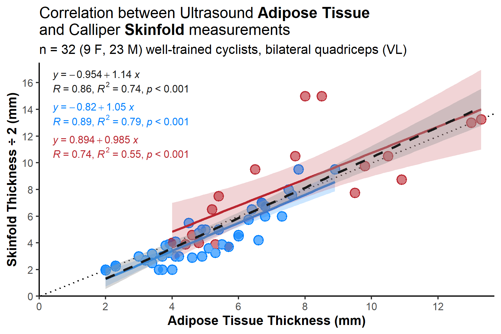
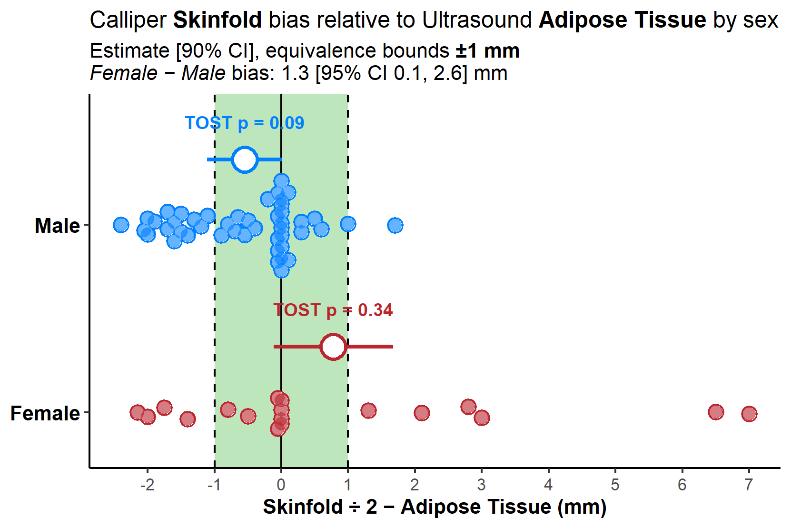

# Ultrasound Adipose Tissue Thickness ~ Calliper Skinfold Correlation
Jem Arnold <a href="https://github.com/jemarnold/mnirs"
target="&quot;_blank&quot;"></a>
<a href="https://www.linkedin.com/in/jem--arnold/"
target="&quot;_blank&quot;"></a>
<a href="https://researchgate.net/profile/Jem-Arnold"
target="&quot;_blank&quot;"></a>
<a href="https://orcid.org/0000-0003-3908-9447"
target="&quot;_blank&quot;"></a>
2026-10-04

``` r
library(tidyverse)
library(ggpmisc)
library(mnirs)
library(lme4)
library(lmerTest)
library(rmcorr)
library(emmeans)
library(marginaleffects)

theme_set(JAPackage::theme_JA(base_size = 16, base_family = "sans"))
```

> [!NOTE]
>
> ### Methods
>
> - Sample is **32** young, well-trained female and male competitive
>   cyclists in the Netherlands in 2022.
>
> - Mix of patients with blood flow limitations in the iliac artery and
>   healthy participants (pooled for this analysis).
>
> - Ultrasound adipose tissue thickness (ATT) vs calliper skinfold
>   thickness (SKF).
>
> - Measurements taken at bilateral quadriceps (VL) at 1/3 distance from
>   patella to greater trochanter.
>
> - Skinfold values divided by 2, comparable to ATT.

## Data

``` r
df
```

    # A tibble: 64 × 5
       id    sex   leg     skf   att
       <fct> <fct> <fct> <dbl> <dbl>
     1 01    Male  L      7      6.7
     2 01    Male  R      6      7.3
     3 02    Male  L      9.5    7.8
     4 02    Male  R      9.5    8.9
     5 03    Male  L      3      4.9
     6 03    Male  R      3.25   5.3
     7 04    Male  L      3      3.7
     8 04    Male  R      3      4.2
     9 05    Male  L      3      4.1
    10 05    Male  R      3.25   3.9
    # ℹ 54 more rows

``` r
## participants by sex
df |>
    distinct(id, sex) |>
    count(sex)
```

    # A tibble: 2 × 2
      sex        n
      <fct>  <int>
    1 Male      23
    2 Female     9

## Figure 1: ATT vs Skinfold correlation

- Dotted line: line of identity.

- Dashed grey line: full group regression.

- Coloured lines: blue is males, red is females.

``` r
# fmt: skip
ggplot(df, aes(x = att, y = skf, colour = sex, fill = sex)) +
    labs(
        title = "Correlation between Ultrasound **Adipose Tissue**<br>and Calliper **Skinfold** measurements",
        subtitle = str_glue("n = 32 (9 F, 23 M) well-trained cyclists, bilateral quadriceps (VL)"),
        x = "Adipose Tissue Thickness (mm)",
        y = "Skinfold Thickness ÷ 2 (mm)"
    ) +
    scale_colour_mnirs() +
    scale_fill_mnirs() +
    coord_cartesian(xlim = c(0, NA), ylim = c(0, NA)) +
    scale_x_continuous(
        breaks = seq(0, 12, 2),
        expand = expansion(c(0, 0.03))
    ) +
    scale_y_continuous(
        breaks = seq(0, 18, 2),
        expand = expansion(c(0, 0.03))
    ) +
    geom_abline(slope = 1, intercept = 0, linetype = "dotted") +
    geom_point(fill = "white", size = 4.4, shape = 21, stroke = 1.5) +
    geom_point(colour = "white", size = 4.2) +
    geom_point(size = 5.0, shape = 21, stroke = 0, alpha = 0.6) +
    geom_smooth(formula = y ~ x, method = "lm", se = TRUE, alpha = 0.2) +
    geom_smooth(
        inherit.aes = FALSE,
        aes(x = att, y = skf),
        formula = y ~ x, method = "lm", se = TRUE,
        colour = "grey10", linetype = 2, alpha = 0.4
    ) +
    ## full group stats
    stat_poly_eq(
        use_label(c("eq"), other.mapping = aes(x = att, y = skf)),
        inherit.aes = FALSE,
        formula = y ~ x, method = "lm",
        label.x = c(0.03), label.y = c(0.97),
        colour = "grey10", size = 4.5
    ) +
    stat_correlation(
        use_label(c("r", "rr", "p"), other.mapping = aes(x = att, y = skf)),
        inherit.aes = FALSE,
        method = "pearson", small.r = FALSE, small.p = TRUE,
        label.x = c(0.03), label.y = c(0.92),
        colour = "grey10", size = 4.5
    ) +
    ## per-sex stats
    stat_poly_eq(
        use_label(c("eq")),
        formula = y ~ x, method = "lm",
        label.x = c(0.03), label.y = c(0.83, 0.69), size = 4.5
    ) +
    stat_correlation(
        use_label(c("r", "rr", "p")),
        method = "pearson", small.r = FALSE, small.p = TRUE,
        label.x = c(0.03), label.y = c(0.78, 0.64), size = 4.5
    )
```



## Repeated-measures correlation

- Accounts for bilateral (L & R) measurements within participant.

``` r
rmcorr(
    participant = id,
    measure1 = att,
    measure2 = skf,
    dataset = df,
)
```

    Repeated measures correlation

    r
    0.6308321

    degrees of freedom
    31

    p-value
    8.299241e-05

    95% confidence interval
    0.3670056 0.8007273 

## Figure 2: Skinfold bias & equivalence by sex

- Bias (Δ) = SKF ÷ 2 − ATT, per leg. Positive values: skinfold
  overestimates adipose tissue.

- Individual points & estimated marginal means \[90% CI\] from mixed
  effects model `delta ~ sex * leg + (1 | id)`, pooled over legs.

- Two one-sided tests (TOST) with equivalence bounds chosen at **±1 mm**
  (shaded region): “*is SKF ÷ 2 within ±1 mm of ATT on average?*”
  Equivalence is supported when the full 90% CI lies within the shaded
  region.

- Suggests a sex interaction, where skinfolds tend to overestimate
  adipose tissue more in females than in males.

- Weak/inconclusive equivalence, sensitive to a couple of outliers in
  this small dataset.

``` r
delta_df <- mutate(df, delta = skf - att)

delta_fit <- lmer(delta ~ sex * leg + (1 | id), data = delta_df)

## mean bias by sex, averaged over legs
delta_emm <- emmeans(delta_fit, ~sex)

## female vs male difference in bias
delta_contrast <- contrast(delta_emm, "revpairwise") |>
    confint() |>
    as.data.frame()

delta_contrast
```

     contrast      estimate       SE df   lower.CL upper.CL
     Female - Male 1.327778 0.620822 30 0.05989013 2.595665

    Results are averaged over the levels of: leg 
    Degrees-of-freedom method: kenward-roger 
    Confidence level used: 0.95 

``` r
## equivalence bound (mm)
eq_bound <- 1

## TOST p-values with matching 90% CI, by sex, averaged over legs
## population-level predictions (re.form = NA), between-participant df
eq_df <- marginaleffects::avg_predictions(
    delta_fit,
    by = "sex",
    re.form = NA,
    conf_level = 0.90,
    equivalence = c(-eq_bound, eq_bound),
    df = n_distinct(delta_df$id) - 2
) |>
    as.data.frame()

eq_df
```

         sex   estimate std.error statistic   p.value s.value   conf.low
    1   Male -0.5500000 0.3292406 -1.670511 0.1052207 3.24851 -1.1088072
    2 Female  0.7777778 0.5263274  1.477745 0.1498987 2.73794 -0.1155372
        conf.high df statistic.noninf statistic.nonsup p.value.noninf
    1 0.008807165 30         1.366782       -4.7078036    0.090924980
    2 1.671092766 30         3.377703       -0.4222129    0.001019844
      p.value.nonsup p.value.equiv
    1   2.655174e-05    0.09092498
    2   3.379401e-01    0.33794013

``` r
# fmt: skip
ggplot(delta_df, aes(x = delta, y = sex, colour = sex, fill = sex)) +
    labs(
        title = "Calliper **Skinfold** bias relative to Ultrasound **Adipose Tissue** by sex",
        subtitle = str_glue_data(
            delta_contrast,
            "Estimate [90% CI], equivalence bounds **±{eq_bound} mm**<br>",
            "*Female − Male* bias: {round(estimate, 1)} [95% CI {round(lower.CL, 1)}, {round(upper.CL, 1)}] mm"
        ),
        x = "Skinfold ÷ 2 − Adipose Tissue (mm)",
        y = NULL
    ) +
    theme(
        legend.position = "none",
        plot.title = ggtext::element_textbox(size = 18),
        axis.text.y = element_text(size = 16, colour = "black", face = "bold"),
    ) +
    scale_colour_mnirs() +
    scale_fill_mnirs() +
    scale_x_continuous(breaks = seq(-2, 8, 1)) +
    ## male on top
    scale_y_discrete(limits = rev, expand = expansion(add = c(0.3, 0.7))) +
    annotate(
        "rect", xmin = -eq_bound, xmax = eq_bound, ymin = -Inf, ymax = Inf,
        fill = "palegreen3", alpha = 0.5
    ) +
    geom_vline(xintercept = c(-eq_bound, eq_bound), linetype = "dashed") +
    geom_vline(xintercept = 0) +
    ## narrower spread for smaller female group
    map2(c("Male", "Female"), c(0.25, 0.1), \(.sex, .width) {
        .df <- filter(delta_df, sex == .sex)
        list(
            ggbeeswarm::geom_quasirandom(
                data = .df, width = .width,
                fill = "white", size = 4.4, shape = 21, stroke = 1.5,
            ),
            ggbeeswarm::geom_quasirandom(
                data = .df, width = .width,
                colour = "white", size = 4.2,
            ),
            ggbeeswarm::geom_quasirandom(
                data = .df, width = .width,
                size = 5.0, shape = 21, stroke = 0, alpha = 0.6,
            )
        )
    }) +
    geom_pointrange(
        data = eq_df,
        aes(x = estimate, xmin = conf.low, xmax = conf.high),
        position = position_nudge(y = 0.35),
        size = 2, linewidth = 1.5, shape = 21, fill = "white", stroke = 2
    ) +
    geom_text(
        data = eq_df,
        aes(x = estimate, label = str_glue("TOST p = {round(p.value.equiv, 2)}")),
        position = position_nudge(y = 0.55),
        size = 5, fontface = "bold"
    )
```



``` r
sessionInfo()
## R version 4.5.3 (2026-03-11 ucrt)
## Platform: x86_64-w64-mingw32/x64
## Running under: Windows 11 x64 (build 26100)
## 
## Matrix products: default
##   LAPACK version 3.12.1
## 
## locale:
## [1] LC_COLLATE=English_Canada.utf8  LC_CTYPE=English_Canada.utf8   
## [3] LC_MONETARY=English_Canada.utf8 LC_NUMERIC=C                   
## [5] LC_TIME=English_Canada.utf8    
## 
## time zone: America/Vancouver
## tzcode source: internal
## 
## attached base packages:
## [1] stats     graphics  grDevices utils     datasets  methods   base     
## 
## other attached packages:
##  [1] marginaleffects_0.32.0 emmeans_2.0.3          rmcorr_0.7.0          
##  [4] lmerTest_3.2-1         lme4_2.0-1             Matrix_1.7-5          
##  [7] mnirs_0.6.5.9000       ggpmisc_0.7.0          ggpp_0.6.0            
## [10] lubridate_1.9.5        forcats_1.0.1          stringr_1.6.0         
## [13] dplyr_1.2.1            purrr_1.2.2            readr_2.2.0           
## [16] tidyr_1.3.2            tibble_3.3.1           ggplot2_4.0.3         
## [19] tidyverse_2.0.0       
## 
## loaded via a namespace (and not attached):
##  [1] tidyselect_1.2.1    psych_2.6.5         farver_2.1.2       
##  [4] S7_0.2.2            fastmap_1.2.0       digest_0.6.39      
##  [7] estimability_2.0.0  timechange_0.4.0    lifecycle_1.0.5    
## [10] survival_3.8-6      magrittr_2.0.5      compiler_4.5.3     
## [13] rlang_1.3.0         tools_4.5.3         utf8_1.2.6         
## [16] yaml_2.3.12         data.table_1.18.4   knitr_1.51         
## [19] mnormt_2.1.2        xml2_1.6.0          RColorBrewer_1.1-3 
## [22] withr_3.0.3         numDeriv_2016.8-1.1 grid_4.5.3         
## [25] JAPackage_0.1.0     xtable_1.8-8        scales_1.4.0       
## [28] MASS_7.3-65         insight_1.5.1       cli_3.6.6          
## [31] mvtnorm_1.4-1       rmarkdown_2.31      reformulas_0.4.4   
## [34] generics_0.1.4      otel_0.2.0          tzdb_0.5.0         
## [37] minqa_1.2.8         polynom_1.4-1       splines_4.5.3      
## [40] parallel_4.5.3      vctrs_0.7.3         boot_1.3-32        
## [43] jsonlite_2.0.0      SparseM_1.84-2      hms_1.1.4          
## [46] pbkrtest_0.5.5      glue_1.8.1          nloptr_2.2.1       
## [49] ggtext_0.1.2        stringi_1.8.7       gtable_0.3.6       
## [52] pillar_1.11.1       htmltools_0.5.9     quantreg_6.1       
## [55] R6_2.6.1            Rdpack_2.6.6        evaluate_1.0.5     
## [58] lattice_0.22-9      rbibutils_2.4.1     png_0.1-9          
## [61] backports_1.5.1     gridtext_0.1.6      broom_1.0.13       
## [64] MatrixModels_0.5-4  Rcpp_1.1.2          coda_0.19-4.1      
## [67] nlme_3.1-169        checkmate_2.3.4     xfun_0.59          
## [70] pkgconfig_2.0.3
```
