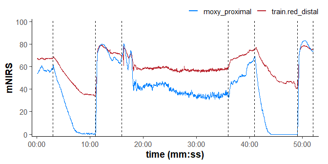
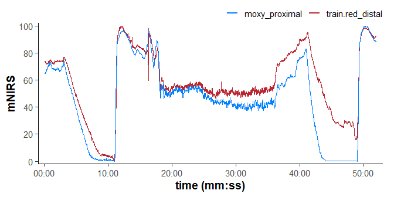
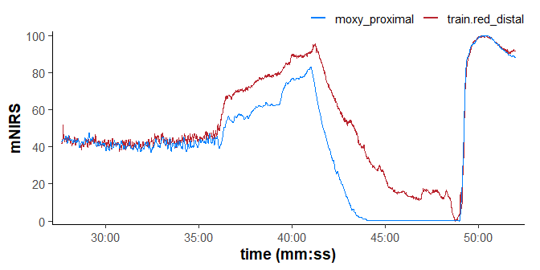
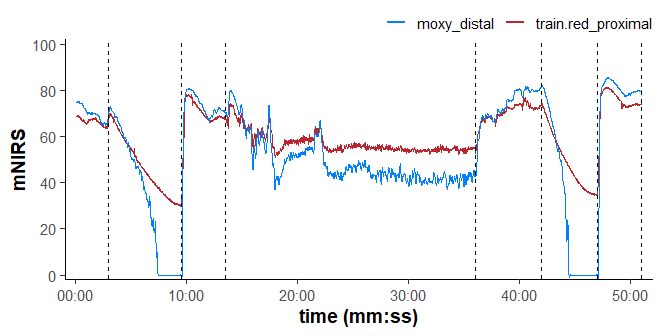
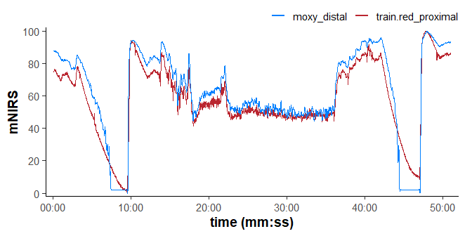
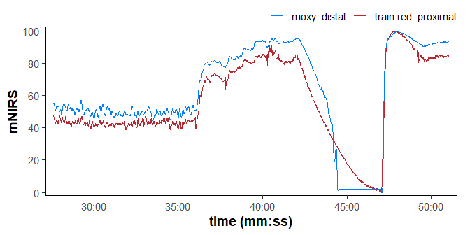
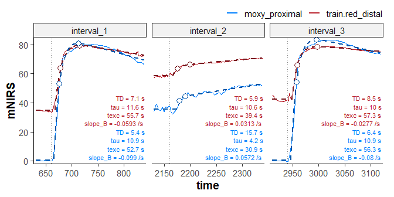
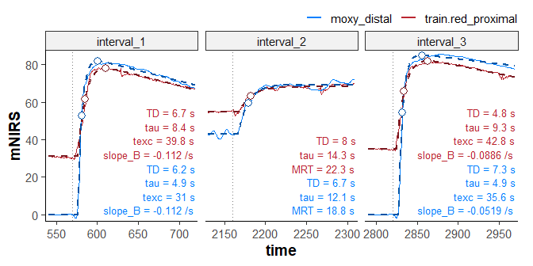

# Comparison of Moxy and Train.Red
Jem Arnold <a href="https://github.com/jemarnold/mnirs"
target="&quot;_blank&quot;"></a>
<a href="https://www.linkedin.com/in/jem--arnold/"
target="&quot;_blank&quot;"></a>
<a href="https://researchgate.net/profile/Jem-Arnold"
target="&quot;_blank&quot;"></a>
<a href="https://orcid.org/0000-0003-3908-9447"
target="&quot;_blank&quot;"></a>
2026-10-04

When I’ve simultaneously tested **Moxy** and **Train.Red** previously,
I’ve been satisfied that they mostly follow the same kinetics, when
rescaled to an equivalent range.

> [!NOTE]
>
> ### Methods
>
> - **Moxy 5** running firmware *1.6.10* recording at **10 Hz**,
>   inter-optode spacing **25mm**.
>
> - **Train.Red FYER** running firmware *2.0.34* recording at **10 Hz**,
>   inter-optode spacing **35mm**.
>
> - Moxy positioned on the **proximal right VL** at around 1/2 distance.
>   Train.Red positioned on the **distal right VL** around 1/3 distance
>   from patella. Around 5 cm between sensors.
>
> - Calliper skinfolds: distal = 5 mm, proximal = 6 mm.
>
> - Both recording to *PerfPro* app via Ant+, receiving at **2 Hz**.
>
> - Train.Red had a few inconsequential signal dropouts, so I’m removing
>   them as outliers.
>
> - Train.Red is smoothed onboard with unspecified parameters. Moxy is
>   raw signal. So I’m filtering Moxy only with a Butterworth low-pass
>   filter, order = 2, frequency cutoff = 0.15 Hz (6.67 cycles/sec).

> [!NOTE]
>
> ### Protocol
>
> - 3-min seated rest baseline.
>
> - 8-min resting ischaemic occlusion.
>
> - 5-min recovery hyperaemia.
>
> - 20-min moderate treadmill running, purpose to reach “warmed-up”
>   working muscle vasodilation.
>
> - 5-min resting exercise recovery.
>
> - 8-min ischaemic occlusion.
>
> - 2-min recovery hyperaemia (then the Train.Red sensor battery died).
>
> Dashed lines in the plot below


``` r
library(dplyr)
library(ggplot2)
library(mnirs)

theme_set(theme_mnirs(base_size = 16))
```

``` r
session_one <- read_mnirs(
    files[1],
    nirs_channels = c(
        train.red_distal = "smo2_right_distal",
        moxy_proximal = "smo2_right_proximal"
    ),
    time_channel = c(time = "Time"),
) |>
    replace_mnirs(
        nirs_channels = train.red_distal,
        outlier_cutoff = 3,
        span = 15
    ) |>
    tail(-10) |> 
    head(-120) |>
    filter_mnirs(
        nirs_channels = moxy_proximal,
        method = "butterworth",
        order = 2,
        fc = 0.15
    ) |>
    create_mnirs_data(nirs_channels = c(train.red_distal, moxy_proximal))

plot(session_one, time_labels = TRUE) +
    coord_cartesian(ylim = c(0, 100)) + 
    geom_vline(xintercept = c(3, 11, 16, 36, 41, 49, 52)*60, linetype = 2)
```



## Rescale amplitudes

Test one: rescale both signals to their ischaemic calibration range.

``` r
session_one |>
    rescale_mnirs(
        group_channels = "distinct",
        range = c(0, 100)
    ) |> 
    plot(time_labels = TRUE)
```



## The first half

The first half of the session have equivalent amplitude and kinetics:
the first occlusion, hyperaemic recovery, through the first half of the
exercise interval are essentially overlapping.

The signals begin to diverge around half way through exercise. This
could be attributed to the different sensor positions and expected
differences in perfusion. Although I would have expected the distal
Train.Red to show greater deoxygenation.

Alternatively, Train.Red could be treating the tissue signal
homogenously, and could be picking up more of the expected cutaneous
thermoregulatory perfusion. While Moxy attempts to prioritise the deeper
signal and returns more deoxygenation from the muscle.

## The second occlusion

The second occlusion in the “warmed-up” state after exercise is more
different. Moxy reached zero very quickly and essentially lost signal.
We have seen this before in Moxy typically in highly vascularised, lean
males, and speculate that the signal could be near-completely absorbed
by blood volume before returning to the receiver.

## Isolate the second occlusion

Rescaling to the second occlusion only reveals the kinetics are more in
line, especially during reoxygenation.

I interpret the noise in Train.Red at the bottom of the occlusion to be
basically equivalent to the ‘zero’ signal in Moxy. They both represent
weak/lost signal.

Train.Red continues to deoxygenate for approximately 60-sec longer than
Moxy before bottoming out.

``` r
session_one |>
    tail(-3000) |>
    rescale_mnirs(
        group_channels = "distinct",
        range = c(0, 100)
    ) |>
    plot(time_labels = TRUE)
```



# Repeating the trial

> [!NOTE]
>
> ### Methods
>
> - As previous, with **Moxy** on **distal right VL** and **Train.Red**
>   on **proximal right VL**.
>
> - Train.Red outliers removed and Moxy filtered as previously.

> [!NOTE]
>
> ### Protocol
>
> - 3-min seated rest baseline.
>
> - 6.5-min resting ischaemic occlusion. Until visual Train.Red plateau
>   reached.
>
> - 4-min recovery hyperaemia.
>
> - 20-min moderate cycling as warm-up stimulus this time.
>
> - 6-min resting exercise recovery.
>
> - 5-min ischaemic occlusion. Until visual Train.Red plateau reached.
>
> - 4-min recovery hyperaemia.
>
> Dashed lines in the plot below

``` r
session_two <- read_mnirs(
    files[2],
    nirs_channels = c(
        moxy_distal = "smo2_right_distal",
        train.red_proximal = "smo2_right_proximal"
    ),
    time_channel = c(time = "Time"),
) |>
    replace_mnirs(
        nirs_channels = train.red_proximal,
        outlier_cutoff = 3,
        span = 15
    ) |>
    mutate(
        train.red_proximal = replace(
            train.red_proximal,
            between(time, 1056.88, 1061.29),
            NA
        )
    ) |>
    tail(-10) |>
    filter_mnirs(
        nirs_channels = moxy_distal,
        method = "butterworth",
        order = 2,
        W = 0.12
    ) |>
    create_mnirs_data(nirs_channels = c(train.red_proximal, moxy_distal))

plot(session_two, time_labels = TRUE) +
    coord_cartesian(ylim = c(0, 100)) +
    geom_vline(xintercept = c(3, 9.5, 13.5, 36, 42, 47, 51) * 60, linetype = 2)
```



## Rescale

``` r
session_two |>
    rescale_mnirs(
        group_channels = "distinct",
        range = c(0, 100)
    ) |>
    plot(time_labels = TRUE)
```



I was surprised at the Moxy dropouts during both occlusions, making it
more difficult to compare kinetics. It may be related to the same issue
as speculated above, over the distal VL, with less adipose tissue and
expecting greater deoxygenation.

The rest of the file agrees quite well after rescaling.

## Isolate the second occlusion

``` r
session_two |>
    tail(-3000) |>
    rescale_mnirs(
        group_channels = "distinct",
        range = c(0, 100)
    ) |>
    plot(time_labels = TRUE)
```



This session leaves me feeling the Moxy is missing real physiological
range that Train.Red is picking up. Which may be compounded in this case
by an interaction of (A) the distal vs proximal muscle locations, (B)
the sensor optode widths/depths, and (C) the tissue homogeneity signal
processing philosophies.

## Comparing kinetics

Without rescaling amplitudes we can compare reoxygenation kinetics from
the two occlusions and end of exercise in each session.

> [!NOTE]
>
> ### Two-phase exponential-linear kinetics
>
> Compare `tau`; the time constant in seconds, and `MRT`; the mean
> response time of the time delay (`TD`) plus `tau`, within each of the
> three intervals (occlusion, exercise, occlusion).
>
> `texc` is the excursion time where the fast exponential kinetics
> transition into the linear drift.
>
> They are mostly within a couple of seconds. Exercise reoxygenation is
> the most different. Session one shows closer values than Session two.
> Purely qualitative comparisons here.
>
> `Slope_B` is the linear asymptote slope, and is expected to be
> different related to the device amplitudes.

### Session one

``` r
extract_intervals(
    session_one,
    start = by_time(11 * 60, 36 * 60, 49 * 60),
    span = c(-30, 180)
) |>
    analyse_kinetics(
        method = "exponential-linear"
    ) |> 
    print() |> 
    plot(label_size = 3)
```

    Exponential-Linear Drift Two-Phase Kinetics
        Model Coefficients:
        interval    nirs_channels start_time             model      A     B    TD
    1 interval_1 train.red_distal      660.0 exponential_drift  34.74 80.69 7.145
    2 interval_1    moxy_proximal      660.0 exponential_drift 0.3909 83.11 5.354
    3 interval_2 train.red_distal       2160 exponential_drift  58.45 66.28 5.878
    4 interval_2    moxy_proximal       2160 exponential_drift  35.65 44.31 15.70
    5 interval_3 train.red_distal       2940 exponential_drift  42.26 79.10 8.536
    6 interval_3    moxy_proximal       2940 exponential_drift 0.6405 85.28 6.416
        tau       k   MRT  texc  slope_B
    1 11.55 0.08656 18.70 55.74 -0.05928
    2 10.93 0.09151 16.28 52.74 -0.09899
    3 10.61 0.09422 16.49 39.43  0.03129
    4 4.245  0.2356 19.94 30.87  0.05720
    5 9.979  0.1002 18.52 57.34 -0.02775
    6 10.91 0.09164 17.33 56.33 -0.07997



### Session two

``` r
extract_intervals(
    session_two,
    start = by_time(9.5*60, 36*60, 47*60),
    span = c(-30, 150)
) |> 
    analyse_kinetics(
        method = "exponential-linear"
    ) |> 
    print() |> 
    plot()
```

    Exponential-Linear Drift Two-Phase Kinetics
        Model Coefficients:
        interval      nirs_channels start_time             model        A     B
    1 interval_1 train.red_proximal      570.0 exponential_drift    30.88 79.64
    2 interval_1        moxy_distal      570.0 exponential_drift -0.07489 83.35
    3 interval_2 train.red_proximal       2160   monoexponential    54.82 68.15
    4 interval_2        moxy_distal       2160   monoexponential    42.98 69.22
    5 interval_3 train.red_proximal       2820 exponential_drift    34.95 83.55
    6 interval_3        moxy_distal       2820 exponential_drift -0.06782 85.93
         TD   tau       k   MRT  texc  slope_B
    1 6.651 8.384  0.1193 15.04 39.77  -0.1120
    2 6.226 4.934  0.2027 11.16 31.00  -0.1117
    3 8.027 14.30 0.06994 22.33    NA       NA
    4 6.667 12.11 0.08259 18.77    NA       NA
    5 4.792 9.327  0.1072 14.12 42.80 -0.08858
    6 7.291 4.855  0.2060 12.15 35.61 -0.05190



``` r
sessionInfo()
## R version 4.6.1 (2026-06-24 ucrt)
## Platform: x86_64-w64-mingw32/x64
## Running under: Windows 11 x64 (build 26100)
## 
## Matrix products: default
##   LAPACK version 3.12.1
## 
## locale:
## [1] LC_COLLATE=English_Canada.utf8  LC_CTYPE=English_Canada.utf8   
## [3] LC_MONETARY=English_Canada.utf8 LC_NUMERIC=C                   
## [5] LC_TIME=English_Canada.utf8    
## 
## time zone: America/Vancouver
## tzcode source: internal
## 
## attached base packages:
## [1] stats     graphics  grDevices utils     datasets  methods   base     
## 
## other attached packages:
## [1] mnirs_0.8.0   ggplot2_4.0.3 dplyr_1.2.1  
## 
## loaded via a namespace (and not attached):
##  [1] vctrs_0.7.3        cli_3.6.6          knitr_1.51         rlang_1.3.0       
##  [5] xfun_0.60          otel_0.2.0         generics_0.1.4     S7_0.2.2          
##  [9] jsonlite_2.0.0     glue_1.8.1         htmltools_0.5.9    readxl_1.5.0      
## [13] scales_1.4.0       rmarkdown_2.32     cellranger_1.1.0   grid_4.6.1        
## [17] evaluate_1.0.5     tibble_3.3.1       MASS_7.3-66        fastmap_1.2.0     
## [21] yaml_2.3.12        lifecycle_1.0.5    compiler_4.6.1     RColorBrewer_1.1-3
## [25] pkgconfig_2.0.3    farver_2.1.2       digest_0.6.39      signal_1.8-1      
## [29] R6_2.6.1           tidyselect_1.2.1   pillar_1.11.1      magrittr_2.0.5    
## [33] withr_3.0.3        tools_4.6.1        gtable_0.3.6
```
