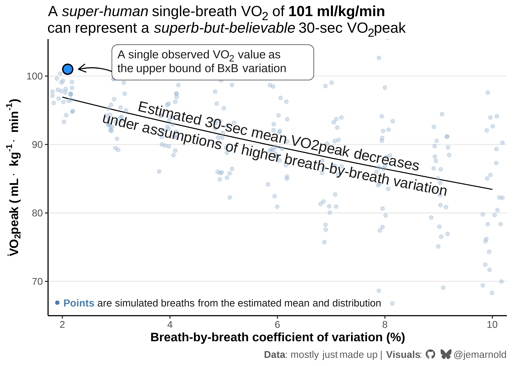

# Superhuman VO2peak Estimate
Jem Arnold [](https://github.com/jemarnold)
[](https://bsky.app/profile/jemarnold.bsky.social)
[](https://researchgate.net/profile/Jem-Arnold)
[](https://orcid.org/0000-0003-3908-9447)
2026-01-30

In a recent instagram post, `@kristianblu` showed a screenshot with a
VO<sub>2</sub> reading of **101 ml/kg/min**. If this were to be
validated, it would be - to my knowledge - the highest recorded
VO<sub>2</sub>peak, and the first human to record over *100* ml/kg/min.

Big if true.

Big ‘if’.

VO<sub>2</sub>peak is typically defined as the peak average oxygen
uptake recorded over 30-seconds. More likely, I suspect, the *101* value
represents the highest *single breath* recorded during the trial, not a
formal 30-sec VO<sub>2</sub>peak.

I don’t know if any of this is true or valid or even interesting, but I
thought it might be interesting to do some metabolic maths on the
numbers we have, to put Kristian’s potential values here in perspective.

First, I wanted to estimate what Kristian’s mean 30-sec VO<sub>2</sub>
value might be to see a single value of *101*, given known variance of
typical breath-by-breath measurements.

First let’s assume *101* represents the upper bound of the
VO<sub>2</sub> data sampled within the 30-sec BxB data.

To estimate the mean 30-sec VO<sub>2</sub> value from that upper bound,
we need to estimate

1.  the number of samples, i.e. the number of breaths, and;
2.  the expected coefficient of variation (CV) for BxB VO<sub>2</sub>
    data.

It turns out the number of breaths doesn’t meaningfully impact the
results per se. Only if it influences the variance of the measurements,
which I don’t know if/how it does. So we can stick with a reasonable
static value of 50 breaths per minute.

CV is tougher to estimate, and depends very much on the athlete and the
metabolic system. But from looking at some recent data collected in our
lab with Parvo TrueOne 2400, I’d estimate a potentially wide range of
*5-10%*. This represents the variability between breaths during a 30-sec
period around VO<sub>2</sub>peak.

<details class="code-fold">
<summary>Show setup code</summary>

``` r
library(tidyverse)
library(geomtextpath)
library(ggtext)
library(sysfonts)
library(showtext)

sysfonts::font_add(
    family = "fa-brands",
    regular = r"(C:\Users\Jem\AppData\Local\Microsoft\Windows\Fonts\Font Awesome 7 Brands-Regular-400.otf)"
)
showtext::showtext_opts(dpi = 600)
showtext::showtext_auto()

## custom theme
theme_set(
    theme_bw(base_size = 12) +
        theme(
            plot.title = ggtext::element_textbox_simple(
                size = rel(1.2),
                lineheight = 1.1
            ),
            plot.subtitle = ggtext::element_textbox(
                colour = "grey40",
                size = 11,
                face = "italic",
                hjust = 0,
                lineheight = 1.1,
                margin = margin(b = 6)
            ),
            plot.caption = ggtext::element_textbox(
                colour = "grey35",
                halign = 1
            ),
            panel.border = element_blank(),
            axis.line = element_line(),
            axis.title = element_text(face = "bold"),
            panel.grid.major = element_blank(),
            panel.grid.minor = element_blank(),
            legend.position = "none"
        )
)

social_caption <- "<span style='font-family:fa-brands'>&#xf09b; &#xe671;</span> @jemarnold"
```

</details>

<details class="code-fold">
<summary>Show figure 1 code</summary>

``` r
df <- expand_grid(
    cv = seq(0.02, 0.10, 0.01),
    # RR = seq(40, 70, 5), ## negligible influence on results
    RR = 50 ## reasonable estimate for peak RR
) |>
    mutate(
        samples = (RR / 60) * 30,
        t_crit = qt(0.975, samples - 1),
        vo2peak = 101 / (1 + t_crit * cv * sqrt(1 + 1 / samples))
    )

## generate simulated breath-by-breath data for specific CV values
set.seed(13) # for reproducibility
simulated_breaths <- map_df(unique(df$cv), \(.cv) {
    # Get the mean VO2peak for this CV
    mean_vo2 <- df[df$cv == .cv, ]$vo2peak

    # Generate 25 breaths (30-sec at 50 breaths/min)
    n_breaths <- 25

    # Generate normally distributed VO2 values
    tibble(
        cv = .cv,
        breath = seq_len(n_breaths),
    ) |>
        mutate(
            vo2 = rnorm(n_breaths, mean = mean_vo2, sd = mean_vo2 * .cv),
            vo2 = if_else(vo2 > 101, 98, vo2),
        )
})

ylims <- range(df$vo2peak) + (diff(range(df$vo2peak)) * c(-1.2, 1.2))

# fmt: skip
ggplot(df, aes(x = cv, y = vo2peak)) +
    labs( ## labs use markdown formatting with {ggtext}
        title = str_glue(
            "A *super-human* single-breath VO<sub>2</sub> of ",
            "**101 ml/kg/min**<br>can represent a *superb-but-believable* ",
            "30-sec VO<sub>2</sub>peak"
        ),
        caption = str_glue(
            "**Visuals**: {social_caption}"
        )
    ) +
    theme(panel.grid.major.y = element_line()) +
    coord_cartesian(ylim = c(65, 105)) +
    scale_x_continuous(
        name = "Breath-by-breath coefficient of variation (%)",
        labels = scales::percent_format(suffix = ""),
        expand = expansion(0.01)
    ) +
    scale_y_continuous(
        name = expression(bold(
            dot('V')*O['2']*peak~'('~mL%.%kg^'-1'%.%min^'-1'*')'
        )),
        n.breaks = 6,
        expand = expansion(c(0, 0.01))
    ) +
    geom_line() +
    # Add simulated breath-by-breath points
    geom_point(
        data = simulated_breaths,
        aes(x = cv, y = vo2),
        alpha = 0.4, size = 1.5, colour = "#98b6d3",
        position = position_jitter(width = 0.002, height = 0, seed = 123)
    ) +
    annotate(
        "point", x = 0.021, y = 101, size = 4, shape = 21, stroke = 1,
        fill = "dodgerblue"
    ) +
    annotate(
        "curve", x = 0.031, xend = 0.023, y = 100, yend = 101,
        arrow = arrow(length = unit(0.03, "npc")),
        curvature = 0.2
    ) +
    ggtext::geom_textbox(
        data = data.frame(),
        aes(
            x = 0.048, y = 102, 
            label = paste(
                "A single observed VO<sub>2</sub> value as",
                "the upper bound of BxB variation",
                sep = "<br>"
            )
        ),
        colour = "grey10", size = 4, width = unit(70, "mm"),
    ) +
    geomtextpath::geom_textline(
        # data = ~ filter(.x, RR == 70),
        aes(
            label = paste(
                "Estimated 30-sec mean VO2peak decreases",
                "under assumptions of higher breath-by-breath variation",
                sep = "\n"
            )
        ),
        colour = "grey10", linewidth = 0, 
        size = 5, hjust = 0.5, halign = "center", vjust = 0.55
    ) + 
    ggtext::geom_richtext(
        data = data.frame(),
        aes(
            x = -Inf, y = -Inf, 
            label = str_glue(
                "<span style = 'color:#4a7db0'>",
                "**● Points**</span> ",
                "are simulated breaths from the estimated mean and distribution"
            )
        ),
        label.size = NA,
        colour = "grey10", size = 3.5, vjust = -0.2, hjust = -0.01
    )
```

</details>



<details>

<summary>

Figure description (click to expand)
</summary>

A line graph showing the relationship between breath-by-breath
coefficient of variation (x-axis, range = 2-10%) and estimated 30-second
mean VO₂peak (y-axis, 75-105 ml·kg⁻¹·min⁻¹). A blue dot at 101
ml·kg⁻¹·min⁻¹ represents a single observed VO₂ value as the possible
upper bound of breath-by-breath variation. A downward-sloping black line
shows that as CV (breath-by-breath variation) increases from 2% to 10%,
the estimated 30-sec mean VO₂peak decreases from approximately 97 to 83
ml·kg⁻¹·min⁻¹. Additional points representing simulated breaths start
tightly grouped around the mean where CV = 2%, and become more scattered
at the higher CV values, according to the estimated distributttion of
VO2 breath measurements. Figure title: “A super-human single-breath VO₂
of 101 ml·kg⁻¹·min⁻¹ can represent a superb-but-believable 30-sec
VO₂peak”. The line is labelled “Estimated 30 sec mean VO2peak decreases
under assumptions of higher breath by breath variation”. “Visuals:
@jemarnold”.

</details>
